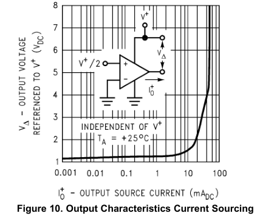

# rc-switch-collaterals

That also means, however, that, for example, audio transmission (albeit low quality)
should be possible (out of scope of this article).

Getting the rc-switch library and peripherals working under RPI-zero.

* https://github.com/sui77/rc-switch.git
* https://github.com/WiringPi/WiringPi.git 

If you want to visualize a telegram copy the raw data and 
paste it into http://test.sui.li/oszi/

## RC-Switch hardware

### General notes

The receiver part is essentially an audio gain circuit.

The transmitter part is a generic sender. Apparently, a clone of the
[315M/433M](datasheet/datasheet_76.pdf) super-regenerative receiver.

That is, they are ANALOG circuits, so DO NOT contain any digital parts.
That means they would probably work with Arduino (a microcontroller) but the RPI
needs to be almost real time to accurately poll or send the data packets when
driving common devices (like SC52XX-based).

That also means, however, that, for example, audio transmission (albeit low quality)
should be possible (out of scope of this article).

---

### FS1000A 433MHz RF transmitter and receiver Brief Note

*October 23, 2023 / Team Communication*

*Last Updated on May 9, 2024*

FS1000A 433MHz RF transmitter and receiver Brief Note For wireless application design.
This 433MHz Tx and Rx module uses ASK (Amplitude Shift Keying) Modulation. These
modules are used in multiple applications like, For Short distance communication,
Home Automation, Remote controls and Car security etc.., Many manufacturers producing
these TX/RX modules with frequency range from 315MHz to 334MHz. Especially *Wenshing*
from Taiwan Makes (303.875MHz / 310MHz / 315MHz / 318MHz / 418MHz / 433.92MHz)
Wireless ASK RF Transmitter and Receiver. Due to its simple operation and shape,
these modules are widely used in many wireless applications. By understanding its
operation and internal schematic you can also explore the ability of ASK RF
Transmitter and Receiver.

Before jumping into the Hardware and Schematic operations, let us recall What is ASK?
and How it works? We know *Amplitude Shift Keying* is the part of Digital Modulation
Techniques. Here input is Digital data either logic HIGH (1) or logic LOW (0) and
the Carrier is sinusoidal wave with 433MHz (frequency varies with respect to Tx/Rx
Module). Depending on the Digital unipolar binary sequence transistor switch Allows
or Stops the Carrier sinusoidal wave. At the output it appears as Amplitude shift
keyed wave. Due to its frequency range and antenna circuitry it becomes RF wave and
propagates.

#### ASK Waveform


As you can see how the ASK wave S(t) is modulated by using the Digital Data m(t),
Carrier Frequency C(t). Depending on the ASK modulator Switch, data modulation
(bit rate) varies.

#### FS1000A 433MHz Transmitter Circuit Diagram


#### FS1000A 433MHz Receiver Circuit Diagram


#### Construction & Working

The Transmitter uses 433MHz Crystal oscillator to produce Carrier signal and
Transistor Q1 S8050 acts as modulator switch and modulates Digital input data
with Carrier signal and converts it into ASK Wave.(SWG18) 8 Turns and 3 Turns
coils produce electromagnetic wave that can be propagated using Antenna. The
schematic above is given for reference and does not exactly replicate the actual
Module. Here the module picture uses 433.92MHz SAW (Surface Acoustic Wave)
Resonator in TO-39 package.

The 433MHz Receiver Module contains the following circuits:

1. Rectifier,
1. Envelope Detector,
1. Comparator and
1. Output Buffer.

After Receiving the ASK RF signal, it is amplified by the transistor T1 and
Rectified by using two 1N4148 Diodes. Then the Comparator LM358 Compares and
separates Enveloped signal then it is converted into Square wave (binary sequence)
as Data output.

Even though there is no specific pin number, the silkscreen text denotes each pin
name. If there is no such text keep the component on the module toward you face and
follow the table for pin details.

#### 433MHz RF TX

|Pin Number	|Pin Name	|Pin Description
|-------|-------|---------------------------------------------
|1	|DATA	|Data Input pin (Data to be Transmitted)
|2	|VCC	|+Ve Power supply to the Transmitter circuit
|3	|GND	|Gnd Supply to the Transmitter circuit
|4 (PCB Via) |ANT 	|Antenna pin to be connected with Wire antenna


#### 433MHZ RF RX

|Pin Number	|Pin Name	|Pin Description
|---------------|---------------|------------------------
|1	|VCC	|+Ve Power supply to the Receiver circuit
|2	|DATA	|Data Output Pin (Data Receiving Pin)
|3	|DATA	|Data Output Pin (Data Receiving Pin)
|4	|GND	|Gnd Supply to the Receiver Circuit
|5 (PCB Via)	|ANT	|Antenna pin to be connected with Wire antenna

#### Specifications

##### For Transmitter Module

* It can operate with 3V to 9V input DC Voltage.
* Operating Frequency is 433.92MHz (433MHz)
* Transmitter consumes 4mA to 40mA current during its operation.
* It can Transmit up to 100 Meter distance.
* It has 10Kbps Data Transmission rate.

##### For Receiver Module

* It can operate with 3.5V to 12V input DC voltage.
* Operating Frequency can be minor tuned 433.92MHz (433MHz)
* Current consumption for operation 20mA – 30mA.
* Data Transfer rate 10Kbps.
* Sensitivity of this receiver is 105db.

#### Interfacing

These modules can be used as Wireless Switch, Discrete logic data Transmitter and
Receiver or by using HT12E Encoder and HT12D Decoder IC we can interface these
modules with Arduino, Raspberry PI or any other micro controllers.

---
### Antenna considerations

Basic physics gives Thomson LC equation (formula for resonant frequency):


When using an external antenna a 1/4 wavelength is recommended. Ideally 
use 50 impedance ohm single-core wire, the length of the antenna 433M is 
about 17cm (1/4 wavelength). When locating the receiver antenna keep it 
as far away as possible from shielded areas, high voltages, and any 
possible interfering frequencies.

I tried 17cm wires straight and coiled (see image) when receiving / transmitting

 

I got much better results using a 19.5 cm connector wire (when receiving)

 

Need a better antenna.

A balanced dipole antenna works extremely well with those modules, shown in the
photo below. The connection labelled GND is actually the other antenna connection!

The antenna wires are each 17 cm long for 433 MHz. I get over 300 meters range,
line of sight with the setup shown.

433 MHz is roughly 70cm wave length... so a half wave dipole is about 33cm .... cut
in half one side to the antenna connector the other side to ground.


### Issues

#### Transmitter inductor missing

They can't work without a vital component in place. That inductor
provides power to the high-frequency oscillator.

Luckily somebody else has gone to the effort of analyzing the issue.

Review this website.

[FS1000A 433 MHZ TRANSMITTER – L2 MISSING](https://vk4ghz.com/fs1000a-433-mhz-transmitter-l2-missing/)

Here is the schematic from that site.


*answered Apr 5, 2022 at 1:57*

* The linked page shows how to solve the problem, but using enamel insulated copper wire to wind the coil. I don't have any of that, but I do have some plastic insulated wire that should work. Assuming I make it the same size: 4mm diameter by 3 turns, and just strip the insulation off the ends to solder it, should that work OK? –  *Commented Apr 5, 2022 at 2:45*
* The inductor is non-critical so should be ok. –  *Commented Apr 5, 2022 at 4:00*
* @dgnuf - You may be interested in the software I use for making inductors. Not affiliated, I just use and enjoy it. It's called Coil64 and you can find it here: coil32.net/download-coil64-for-windows.html – *Commented Apr 5, 2022 at 4:04*

However

> At first glance it may look like the (again, on the modules I have) the shorter
> 3 turn coil is missing (compared to some images I've seen on the internet) but I
> had an SMD version of the coil on the solder side of the PCB. The 'Ant' label shows
> the hole where the collector-side of the non-SMD version of the coil can be
> inserted.

#### Transmitter silk screen for the pins is wrong

The *VCC* and the *DATA* pins are reversed.

On some versions of the FS1000A 433MHz RF transmitter module, the pins are
mislabeled due to a reversed printing process. The label for the *Data* pin,
printed as "*ATAD*" (*DATA* backwards), is incorrect. The correct pinout for
the FS1000A is easily identified by its position relative to the VCC and
Ground pins.

> Connecting the circuit the right way around, the microcontroller/datasource
> output needs to be connected to the pin that has a single PCB trace going into
> a single SMD resistor - nowhere else - and the data source ground to module
> ground. Then the +12V supply to pin where the PCB trace is going e.g. to 8 turn
> coil and the supply ground also to module ground. That way you should be getting
> more power. (Twice the voltage raises the power by 4 times if all the other
> parameters will stay the same - which they will not.)

> I don't have one of my modules right now, but if my memory serves me right, the
> middle pin was the correct pin for the Vcc. Gnd was labeled correctly which
> leaves the remaining pin for the data.

### RPI power considerations

#### The FS0001A transmitter

The transmitter would require higher power for better range and throughput, and should
be OK if connected to +5V. That is, the Data pin could be driven by RPI's 3.3v 
without any additional level shifters, as it drives the base of the transistor.

> The TXD pin is the input to the base of an NPN transistor, so all that's
> necessary is enough voltage to turn on the transistor. Your 3.3v output
> from the RPi should work fine.

That is also reported to work in 12v/5v configurations.

#### The MX-RM-5V receiver

The receiver should not require more than 3.3v of power, otherwise a simple voltage
divider should solve the problem.

Other sources suggest it will only work on 5v power.

> The output circuit makes use of a duel opamp (LM 358) but my understanding is too
> flakey to derive the output voltage from this arrangement.

[LM358 datasheet](datasheet/lm358-n.pdf) page 10:-



This tells you that maximum output voltage is Vcc - ~1.2v = ~3.8v with 5v supply.
The ESP8266's rated maximum I/O input voltage is 3.6v, however it probably has
protection diodes that don't start conducting until pin voltage goes ~0.6v above
the power supply voltage, ie. 3.3 + 0.6 = 3.9v.

So people who are using this combination without level shifting are just getting
away with it if the power supply voltages are accurate. To be safe you should lower
the output voltage by at least 0.5v using e.g. a voltage divider made from two
resistors.


Basic calculation suggests a 2:1 ratio, that is a 4.7K/10K or a 10K/20K resistor
pair.

However it should, in theory, be possible to power it off the 5v rail, as the
device does already contain a voltage divider (in the form of a 2.2M resistor,
acting as R1 on the schematic above).

#### Receiver noise

If powered from the RPI header, there seems to be much noise. This could be fixed
by powering it off an external PSU.

## Devices Driven

### SuperSwitch KSI-194 / KSI-393

The sockets contain *SC5272-M4* to be paired with *SC5262-M4* encoder.
Although that should be signal-compatible with *SC2262* encoder, allowing the KSI-393
remotes to control them.

It has an 8-bit address, with 4 bits of data, capable to drive 16 sockets in theory.

Typically, the sockets contain a label (on the other side of the board, facing the
inner plug prong connections) that lists the address as encoded:

|76543210|outer label|
---------|-----------|
|10F0F1F1|D2451|

where the letter F denotes a *floating* (not connected, NC) bit.

In theory that gives 3^8 = 6561 address combinations.

The remote board has "KS-40" designation.

The encoding is as follows:

|state   | bits |
|--------|------|
| 0 | 00 |
| 1 | 11 |
| F | 01 |

# Software issues

## Python -- RuntimeError: Failed to add edge detection - On RaspberryPI

I am using Bullseye version. I was able to fix this by rolling back the firmware update [rpi-update] to the stable version.

```shell
sudo apt-get update; sudo apt-get install --reinstall raspberrypi-bootloader raspberrypi-kernel
```

After that update the software and reboot.

```shell
sudo apt-get update
sudo apt-get upgrade
```
