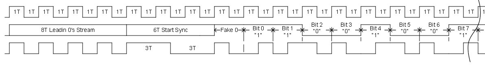
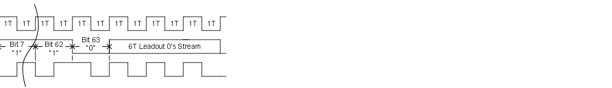
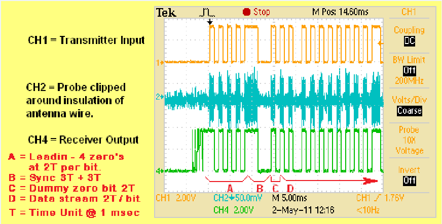
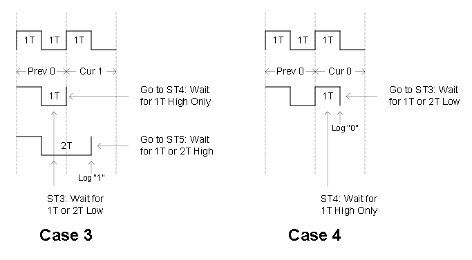
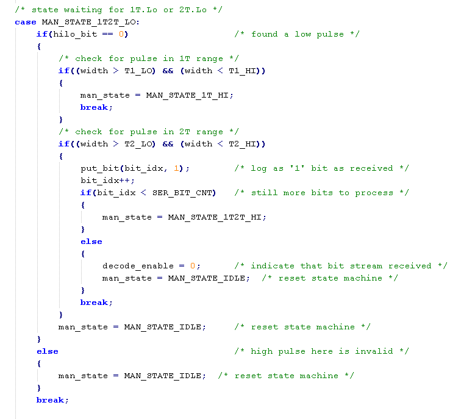

I have implemented with these modules being interfaced via microcontrollers on
each end.

The transmit end is simply connected to an output port pin that gets modulated
in a software interrupt service routine running at 1 KHz. The modulation is
encoded as Manchester format yielding a data bit rate of 500bps. My application
sends 6 or 8 bytes of information about once each minute or so.

The data output pin of the receiver module connects to two separate input
interrupt request pins that are configured to generate interrupts on the
positive signal edges on one pin and on the negative signal edges on the
other pin. These interrupts operate a state machine and use a timer to measure
the received pulse widths and tolerance the measurements over about a 10-30%
range to determine pulses arriving at 1x, 2x, or 3x widths high and low. The
interrupt state machine monitors the present pulse width through the next one
and is able to determine decoded bits of the Manchester data stream. The stream
includes a lead-in sequence followed by a sync pattern (that is where the 3x
pulse widths come in) as they are not legal normal Manchester encoding which
should always be seen as 1x and 2x pulse widths.

The scheme is very reliable and when using 11 to 12V on the transmitter and
6.8 inch straight wire antennas on each end I am able to pickup the
transmissions at a distance of 200 to 300 feet.

So in direct answer to your question...no encoder chips required...all done in
software of the microcontrollers. But be aware that to get reliable
transmissions that you need to use some type or encoding system that allows for
wide tolerance decoding of the received signal. If you try to do what some
folks do and just connect the transmit and receive pins of the module pair to
the TxD and RxD pins of a microcontroller UART do expect to get crappy performance.

Edit: Here are some snippets of design documentation I created for the Manchester
encoder described above:

Here is the modulation diagram. In my application the "T" time unit
is 1 millisecond. Note that I've found it necessary to increase the
leadin 0's stream to 20T or 30T of 0's use to the capture delay of
certain receivers. (There is quite a variation of characteristics of
available 433MHz receiver modules).

Here is a scope shot of the start of a typical transmission sequence:

The receiver state machine that decodes the modulation stream has a number of
states that deal with detecting sync high (3T), sync low (3T), Fake 0 Filler,
Actual Data decoding and so forth. The heart of the data decoding is based
upon a sequence of four possible current state cases and next state
possibilities. (Note that as each bit is logged there is a total bit counter
that keeps track of when the end of the message is detected).

As I described before, the receive decoder measures the width of each received
pulse width and determines its nominal 1T or 2T width by comparing the measured
value against an acceptable range. The wider you can make the acceptable pulse
range the more robust the decoder algorithm can be in dealing with distortions
of the received modulation waveform. You still want to keep a cap on how wide
you make the tolerance so that the decoder is actually picking up the intended
pulses and not some random output from the receiver. The code to check for the
pulse widths in a particular state looks like below. The state machine is called
from the interrupt context that occurs at each falling and rising edge of the
input waveform.

I've used a spreadsheet to compute the pulse range values and exported that as
a set of defines that equate the widths based upon counts in the MCU timer used
to measure the widths. Here is a sample of the calculations for one target
receiver I produced.

RF transmissions using 433MHz are typically line of site for detection by the
receiver. In one of my applications where the path between the transmitting MCU
and one or more of the receiving MCUs was obstructed by large metal / concrete
building structure I built a repeater module that receives the RF packets and
re-transmits it 2 seconds later. Whilst I could have built the repeater using
another MCU I had actually decided to build it around a low cost FPGA
development board purchased on eBay. It was an interesting exercise done with
schematic design at the top level and a number of Verilog modules to perform
the Manchester decode and encode state machines. The following snippet shows
how close the Verilog state machine code looks as compared to the same decoder
state shown above in C code.

In the case of the Verilog sample the measured pulse width was performed in
another module and the comparision results sent as signals to the state
machine decoder module.

*edited Jun 2, 2015 at 12:27*
*answered May 31, 2015 at 6:49*
*Michael Karas*
